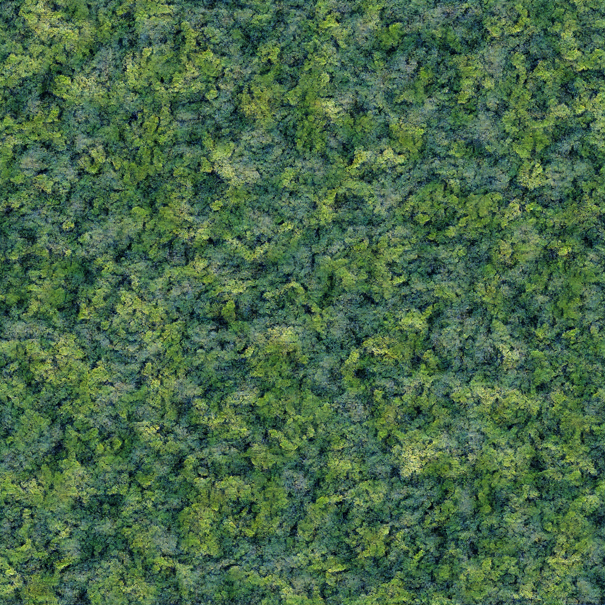

# Texture Synthesis with GANs

This project implements a deep generative model for **texture synthesis** using a specially designed GAN (Generative Adversarial Network) architecture.

It loads a pre-trained generator and produces high-quality textures from random noise.

<p align="center">
  
</p>

---

## About the Project

This model was trained using a custom GAN architecture with upsampling blocks and a rich noise input to produce diverse, detailed texture images.

Training was performed in Google Colab using GPU acceleration. The repo contains a streamlined `main.py` for generating textures using the pre-trained generator.

---

## Getting Started

Clone the repository and set up your environment:

```bash
git clone https://github.com/yourusername/GeneratingTextures-GAN.git
cd GeneratingTextures-GAN
python3 -m venv venv && source venv/bin/activate
pip install -r requirements.txt
```

---

## Generate a Texture

Make sure the pretrained generator is available in the root directory:

```bash
python main.py
```

The output image will be saved to:
```
outputs/generated.png
```

---

## Pretrained Weights

> Download the pre-trained model here: [generator.pth on Google Drive](https://drive.google.com/file/d/13sD0gxnugd4bPHbcLBjWDtv13KbGeecu/view?usp=sharing)

Save the file as `generator.pth` in the project root.

---

## Model Architecture

The generator is built from a stack of upsampling + convolutional layers with `ReLU` activations and a final `Tanh` output layer. A large stochastic noise map is used as input to produce diverse and high-res textures.

> See the full architecture in the Google Collab link

---

## Training (Optional)

Training was done in Colab using a custom dataset and the same generator defined here.  
If you're interested in retraining on a texture of your choice:

- [](https://colab.research.google.com/drive/1bmqDHxv2QKZ_Vo6BKHL1rZySpNXnQJE1?usp=sharing)
- Dataset and training parameters are configurable in the notebook
